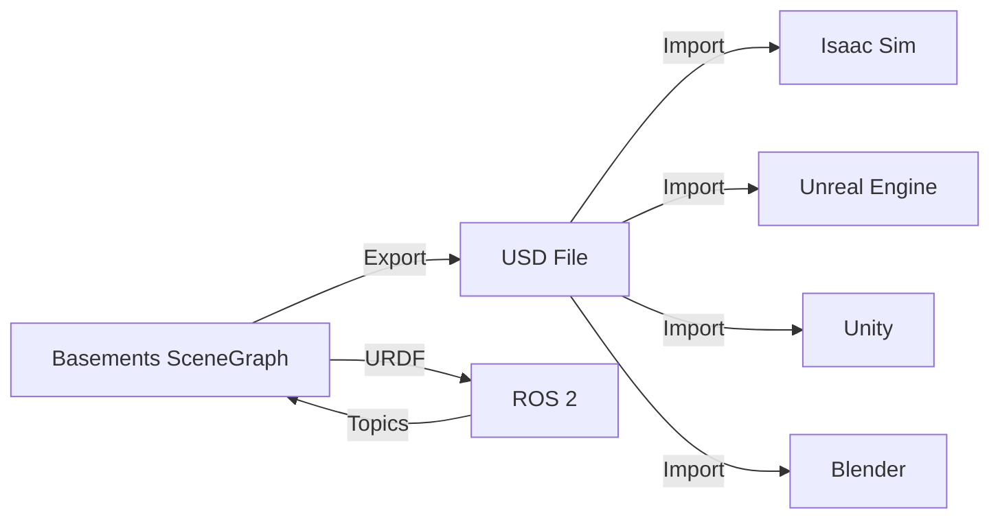

# Basements Physics Engine - API Reference

> **목적**: LLM 에이전트가 Context-Free하게 접근할 수 있도록 모든 Public API의 구조를 기술합니다.
> **형식**: JSON Schema 기반 문서화
> **최종 업데이트**: 2026-03-31
> **참고**: 이 문서는 [multi-scale_engine.md](./multi-scale_engine.md)에 기술된 아키텍처의 구체적인 구현 명세입니다.

---

## 📊 API Verification Status

| Module | API Coverage | Unit Tests | Integration | Documentation |
| :--- | :---: | :---: | :---: | :---: |
| **basements::math** | 100% | ✅ | ✅ | 100% |
| **basements::mpm** | 100% | ✅ | ✅ | 100% |
| **basements::physics** | 85% | ✅ | ✅ | 90% |
| **basements::collision** | 90% | ✅ | ✅ | 95% |
| **basements::engine** | 95% | ✅ | ✅ | 100% — 실제 솔버 완전 구현 |
| **basements::editor** | 90% | — | ✅ | 90% — Phase 3 완료 |
| **basements::io** | 95% | ✅ | ✅ | 100% |

### Include Path Reference (현행 구조)

```
include/basements/
  core/math/     → vec3.h, quaternion.h, matrix3.h, svd.h, common.h
  physics/
    mpm/         → mpm_solver.h, particle.h, spgrid_cpu.h
    collision/   → gjk.h, epa.h, aabb.h, contact_info.h, primitives.h
    dynamics/    → forces.h, joints.h, joint_solver.h, solver.h, integrator.h
    formulas/    → kinematics.h, dynamics.h, energy.h, ... (17 domains)
  engine/        → physics_world_gpu.h, scene_graph.h, command_history.h
  editor/
    editor_app.h
    ui/          → physics_panel.h, inspector_panel.h, hierarchy_panel.h, console_panel.h
    core/        → selection_manager.h, component.h
  graphics/      → renderer.h, camera.h, shader.h, mesh.h, framebuffer.h, gizmo.h
  io/            → urdf_parser.h, urdf_types.h, urdf_converter.h
```

---

## 📚 Table of Contents

| # | Section | Description |
|---|---------|-------------|
| 1 | [Core Types](#1-core-types) | Vec3, Quaternion |
| 2 | [Physics Objects](#2-physics-objects) | RigidBody, Material |
| 3 | [Memory Management](#3-memory-management) | MemoryManager, MemoryTier |
| 4 | [Sensors](#4-sensors) | ISensor |
| 5 | [Collision Detection](#5-collision-detection) | GJK, EPA, ContactInfo |
| 6 | [Dynamics - Forces](#6-dynamics---forces) | ForceGenerator, Gravity, Drag |
| 7 | [Dynamics - Joints](#7-dynamics---joints) | Ball/Hinge/Slider/Fixed, Gear |
| 8 | [Physics - Advanced](#8-physics---advanced) | Fatigue, SoftBody |
| 9 | [Plugin System](#9-plugin-system-c-abi) | C-ABI, PluginLoader |
| 10 | [Aerodynamics](#10-aerodynamics) | Rotor, Quadcopter, WindField |
| 11 | [Fluid Dynamics](#11-fluid-dynamics-sph) | SPHParticle, SPHSolver |
| 12 | [**PhysicsWorldGPU**](#12-physicsworldgpu) | **통합 시뮬레이션 오케스트레이터** — Raycast, QueryAABB, Joints, Contact Cache 포함 |
| 13 | [**Scene Editor**](#13-scene-editor) | **Universal Workspace & Modules** |
| 14 | [**Graphics**](#14-graphics) | **PBR Material System** |
| 15 | [**Backend Abstraction**](#15-backend-abstraction) | **Multi-Platform Compute (CUDA/ROCm/Metal)** |
| 16 | [**Engine Integration**](#16-engine-integration) | **ROS 2, USD, Unreal, Unity** |
| 17 | [**Core Framework**](#17-core-framework) | **TaskSystem, Components, Properties** |

---

## 1. Core Types

### Vec3
```json
{
  "name": "Vec3",
  "namespace": "basements::math",
  "description": "3D 벡터 (위치, 속도, 힘 등에 사용). AVX2 SIMD 최적화 레이아웃.",
  "fields": [
    {"name": "x", "type": "float", "description": "X 성분"},
    {"name": "y", "type": "float", "description": "Y 성분"},
    {"name": "z", "type": "float", "description": "Z 성분"},
    {"name": "v", "type": "__m128", "description": "SIMD 레지스터 데이터 (Internal)"}
  ],
  "methods": [
    {"name": "length", "returns": "float", "description": "벡터의 크기 (L2 Norm)"},
    {"name": "lengthSq", "returns": "float", "description": "L2 Norm의 제곱"},
    {"name": "normalized", "returns": "Vec3", "description": "단위 벡터"},
    {"name": "dot", "inputs": [{"name": "other", "type": "Vec3"}], "returns": "float", "description": "내적 (Dot Product)"},
    {"name": "cross", "inputs": [{"name": "other", "type": "Vec3"}], "returns": "Vec3", "description": "외적 (Cross Product)"},
    {"name": "dist", "inputs": [{"name": "other", "type": "Vec3"}], "returns": "float", "description": "두 점 사이의 거리"}
  ],
  "operators": ["+", "-", "*", "/", "==", "!="]
}
```

### Quaternion
```json
{
  "name": "Quaternion",
  "namespace": "basements::math",
  "description": "회전을 나타내는 사원수",
  "fields": [
    {"name": "w", "type": "float", "description": "스칼라 성분"},
    {"name": "x", "type": "float", "description": "i 성분"},
    {"name": "y", "type": "float", "description": "j 성분"},
    {"name": "z", "type": "float", "description": "k 성분"}
  ],
  "methods": [
    {"name": "rotate", "inputs": [{"name": "v", "type": "Vec3"}], "returns": "Vec3", "description": "벡터 회전"},
    {"name": "normalized", "returns": "Quaternion", "description": "정규화된 쿼터니언"}
  ]
}
```

---

## 2. Physics Objects

### RigidBody
```json
{
  "name": "RigidBody",
  "namespace": "basements::physics",
  "description": "강체 물리 객체",
  "fields": [
    {"name": "position", "type": "Vec3", "unit": "m", "description": "월드 좌표 위치"},
    {"name": "orientation", "type": "Quaternion", "description": "회전 상태"},
    {"name": "linear_velocity", "type": "Vec3", "unit": "m/s", "description": "선속도"},
    {"name": "angular_velocity", "type": "Vec3", "unit": "rad/s", "description": "각속도"},
    {"name": "mass", "type": "float", "unit": "kg", "description": "질량"},
    {"name": "inv_mass", "type": "float", "unit": "1/kg", "description": "역질량 (0 = 정적 객체)"},
    {"name": "force", "type": "Vec3", "unit": "N", "description": "누적된 힘"},
    {"name": "torque", "type": "Vec3", "unit": "N·m", "description": "누적된 토크"},
    {"name": "material_id", "type": "uint32", "description": "재질 ID (MaterialLibrary 참조)"},
    {"name": "temperature", "type": "float", "unit": "K", "description": "현재 온도"}
  ],
  "methods": [
    {"name": "apply_force", "inputs": [{"name": "f", "type": "Vec3"}], "description": "힘 적용"},
    {"name": "apply_torque", "inputs": [{"name": "t", "type": "Vec3"}], "description": "토크 적용"},
    {"name": "apply_impulse", "inputs": [{"name": "j", "type": "Vec3"}, {"name": "r", "type": "Vec3"}], "description": "충격량 적용"}
  ]
}
```

### Material
```json
{
  "name": "Material",
  "namespace": "basements::physics",
  "description": "물리적 재질 속성",
  "fields": [
    {"name": "id", "type": "uint32", "description": "고유 ID"},
    {"name": "name", "type": "string", "description": "재질 이름"},
    {"name": "density", "type": "float", "unit": "kg/m³", "description": "밀도"},
    {"name": "young_modulus", "type": "float", "unit": "Pa", "description": "영률"},
    {"name": "poisson_ratio", "type": "float", "description": "푸아송비"},
    {"name": "friction", "type": "float", "description": "마찰 계수"},
    {"name": "restitution", "type": "float", "description": "반발 계수"},
    {"name": "ultimate_strength", "type": "float", "unit": "Pa", "description": "극한 강도"},
    {"name": "fatigue_exponent", "type": "float", "description": "피로 지수"}
  ]
}
```

---

## 3. Memory Management

### MemoryManager
```json
{
  "name": "MemoryManager",
  "namespace": "basements::memory",
  "description": "Unified RAM-VRAM 메모리 관리자 (Singleton)",
  "methods": [
    {
      "name": "allocate",
      "inputs": [
        {"name": "size", "type": "size_t", "unit": "bytes", "description": "할당 크기"},
        {"name": "tier", "type": "MemoryTier", "default": "COLD", "description": "메모리 계층"}
      ],
      "returns": "uint64_t",
      "description": "메모리 할당, 핸들 반환"
    },
    {
      "name": "free",
      "inputs": [{"name": "handle", "type": "uint64_t"}],
      "description": "메모리 해제"
    },
    {
      "name": "promote",
      "inputs": [{"name": "handle", "type": "uint64_t"}],
      "returns": "bool",
      "description": "상위 계층으로 승격 (COLD→WARM→HOT)"
    },
    {
      "name": "demote",
      "inputs": [{"name": "handle", "type": "uint64_t"}],
      "returns": "bool",
      "description": "하위 계층으로 강등 (HOT→WARM→COLD)"
    }
  ]
}
```

### MemoryTier (Enum)
```json
{
  "name": "MemoryTier",
  "namespace": "basements::memory",
  "type": "enum",
  "values": [
    {"name": "HOT", "value": 0, "description": "GPU VRAM (최고 속도)"},
    {"name": "WARM", "value": 1, "description": "Pinned Host RAM (DMA 최적화)"},
    {"name": "COLD", "value": 2, "description": "Paged Host RAM (OS 관리)"},
    {"name": "ARCHIVED", "value": 3, "description": "SSD (미구현)"}
  ]
}
```

---

## 4. Sensors

### ISensor (Interface)
```json
{
  "name": "ISensor",
  "namespace": "basements::sensor",
  "description": "가상 센서 인터페이스 (사용자 확장 가능)",
  "fields": [
    {"name": "name", "type": "string", "description": "센서 이름"},
    {"name": "parent_body", "type": "RigidBody*", "description": "부착된 강체"},
    {"name": "local_transform", "type": "Transform", "description": "부모 기준 상대 변환"}
  ],
  "methods": [
    {"name": "pre_step", "inputs": [{"name": "dt", "type": "float"}], "description": "물리 계산 전 호출"},
    {"name": "post_step", "inputs": [{"name": "dt", "type": "float"}], "description": "물리 계산 후 호출"},
    {"name": "get_global_pose", "returns": "Transform", "description": "월드 좌표 변환 반환"}
  ]
}
```

---

## 5. Collision Detection

### GJK (Gilbert-Johnson-Keerthi)
```json
{
  "name": "GJK",
  "namespace": "basements::collision",
  "description": "GJK 알고리즘을 사용한 볼록 충돌 감지",
  "methods": [
    {
      "name": "run",
      "template": ["ShapeA", "ShapeB"],
      "inputs": [
        {"name": "shapeA", "type": "ShapeA&"},
        {"name": "txA", "type": "Transform&", "description": "A의 월드 변환"},
        {"name": "shapeB", "type": "ShapeB&"},
        {"name": "txB", "type": "Transform&"},
        {"name": "simplex", "type": "Simplex&", "description": "EPA용 출력 심플렉스"}
      ],
      "returns": "bool",
      "description": "두 형상이 교차하면 true"
    }
  ]
}
```

### EPA (Expanding Polytope Algorithm)
```json
{
  "name": "EPA",
  "namespace": "basements::collision",
  "description": "충돌 심도 및 접촉 벡터 계산",
  "methods": [
    {
      "name": "run",
      "inputs": [
        {"name": "shapeA", "type": "Shape&"},
        {"name": "shapeB", "type": "Shape&"},
        {"name": "simplex", "type": "Simplex&", "description": "GJK에서 받은 심플렉스"}
      ],
      "returns": "ContactInfo",
      "description": "충돌 심도(depth), 접촉점, 법선 반환"
    }
  ]
}
```

### ContactInfo
```json
{
  "name": "ContactInfo",
  "namespace": "basements::collision",
  "description": "충돌 정보 구조체",
  "fields": [
    {"name": "point", "type": "Vec3", "description": "접촉점 (월드 좌표)"},
    {"name": "normal", "type": "Vec3", "description": "충돌 법선 (A에서 B 방향)"},
    {"name": "depth", "type": "float", "unit": "m", "description": "침투 심도"}
  ]
}
```

---

## 6. Dynamics - Forces

### ForceGenerator (Interface)
```json
{
  "name": "ForceGenerator",
  "namespace": "basements::dynamics",
  "description": "힘 생성기 기본 인터페이스",
  "methods": [
    {
      "name": "apply",
      "inputs": [
        {"name": "bodies", "type": "RigidBody*"},
        {"name": "num_bodies", "type": "int"},
        {"name": "dt", "type": "float", "unit": "s"}
      ],
      "description": "모든 강체에 힘 적용"
    }
  ]
}
```

### UniformGravity
```json
{
  "name": "UniformGravity",
  "namespace": "basements::dynamics",
  "extends": "ForceGenerator",
  "description": "균일 중력장 (F = m*g)",
  "fields": [
    {"name": "g", "type": "Vec3", "unit": "m/s²", "default": "(0, -9.81, 0)", "description": "중력 가속도"}
  ],
  "factory_methods": [
    {"name": "Earth", "returns": "UniformGravity", "description": "g = 9.81 m/s²"},
    {"name": "Moon", "returns": "UniformGravity", "description": "g = 1.62 m/s²"},
    {"name": "Mars", "returns": "UniformGravity", "description": "g = 3.71 m/s²"}
  ]
}
```

### AerodynamicDrag
```json
{
  "name": "AerodynamicDrag",
  "namespace": "basements::dynamics",
  "extends": "ForceGenerator",
  "description": "공기저항 (F = -0.5 * ρ * v² * Cd * A)",
  "fields": [
    {"name": "rho", "type": "float", "unit": "kg/m³", "default": "1.225", "description": "유체 밀도"},
    {"name": "C_d", "type": "float", "default": "0.47", "description": "항력 계수"},
    {"name": "A", "type": "float", "unit": "m²", "default": "1.0", "description": "단면적"}
  ]
}
```

### NBodyGravity
```json
{
  "name": "NBodyGravity",
  "namespace": "basements::dynamics",
  "extends": "ForceGenerator",
  "description": "만유인력 (F = G*m1*m2/r²)",
  "fields": [
    {"name": "G", "type": "float", "unit": "m³/kg/s²", "default": "6.674e-11", "description": "중력 상수"},
    {"name": "softening", "type": "float", "default": "0.1", "description": "소프트닝 파라미터"}
  ]
}
```

---

## 7. Dynamics - Joints

### BallSocketJoint
```json
{
  "name": "BallSocketJoint",
  "namespace": "basements::dynamics",
  "description": "구면 조인트 (3 DOF 회전 허용)",
  "fields": [
    {"name": "body_a_index", "type": "int", "description": "첫 번째 강체 인덱스"},
    {"name": "body_b_index", "type": "int", "description": "두 번째 강체 인덱스"},
    {"name": "local_anchor_a", "type": "Vec3", "description": "A 로컬 고정점"},
    {"name": "local_anchor_b", "type": "Vec3", "description": "B 로컬 고정점"}
  ]
}
```

### HingeJoint
```json
{
  "name": "HingeJoint",
  "namespace": "basements::dynamics",
  "description": "경첩 조인트 (1 DOF 회전). 5자유도 제거, 1 회전 허용.",
  "fields": [
    {"name": "body_a_index", "type": "int"},
    {"name": "body_b_index", "type": "int"},
    {"name": "local_anchor_a", "type": "Vec3"},
    {"name": "local_anchor_b", "type": "Vec3"},
    {"name": "local_axis_a", "type": "Vec3", "description": "A 로컬 회전축"},
    {"name": "local_axis_b", "type": "Vec3", "description": "B 로컬 회전축"},
    {"name": "enable_limits", "type": "bool", "default": "false"},
    {"name": "lower_limit", "type": "float", "unit": "rad", "description": "최소 각도"},
    {"name": "upper_limit", "type": "float", "unit": "rad", "description": "최대 각도"},
    {"name": "motor_enabled", "type": "bool", "default": "false"},
    {"name": "motor_velocity", "type": "float", "unit": "rad/s", "description": "목표 각속도"},
    {"name": "motor_max_force", "type": "float", "unit": "N·m", "description": "모터 최대 토크"}
  ],
  "notes": [
    "limit_bias = 0.0 (Baumgarte 없음): 속도 제약만으로 충분, 위치 보정 추가 시 발산",
    "equality_bias = β/dt * violation, β=0.1 (자유 회전 구간)",
    "warm starting으로 수렴 가속 (~2× fewer iterations)"
  ]
}
```

### SliderJoint
```json
{
  "name": "SliderJoint",
  "namespace": "basements::dynamics",
  "description": "슬라이더 조인트 (1 DOF 선형 이동). 5자유도 제거, 1 병진 허용.",
  "fields": [
    {"name": "body_a_index", "type": "int"},
    {"name": "body_b_index", "type": "int"},
    {"name": "local_anchor_a", "type": "Vec3"},
    {"name": "local_anchor_b", "type": "Vec3"},
    {"name": "local_axis_a", "type": "Vec3", "description": "이동 축 (A 로컬)"},
    {"name": "enable_limits", "type": "bool", "default": "false"},
    {"name": "lower_limit", "type": "float", "unit": "m"},
    {"name": "upper_limit", "type": "float", "unit": "m"},
    {"name": "motor_enabled", "type": "bool", "default": "false"},
    {"name": "motor_velocity", "type": "float", "unit": "m/s"},
    {"name": "motor_max_force", "type": "float", "unit": "N"}
  ],
  "notes": [
    "limit_bias = 0.0 — 단측 제약의 Baumgarte 발산 방지 (HingeJoint와 동일)"
  ]
}
```

### FixedJoint
```json
{
  "name": "FixedJoint",
  "namespace": "basements::dynamics",
  "description": "고정 조인트 (0 DOF, 용접)",
  "fields": [
    {"name": "body_a_index", "type": "int"},
    {"name": "body_b_index", "type": "int"},
    {"name": "local_anchor_a", "type": "Vec3"},
    {"name": "local_anchor_b", "type": "Vec3"},
    {"name": "relative_orientation", "type": "Quaternion", "description": "참조 상대 회전"}
  ]
}
```

### GearConstraint
```json
{
  "name": "GearConstraint",
  "namespace": "basements::constraints",
  "description": "기어 제약 조건",
  "fields": [
    {"name": "bodyA_index", "type": "int"},
    {"name": "bodyB_index", "type": "int"},
    {"name": "axisA", "type": "Vec3", "description": "A 회전축 (로컬)"},
    {"name": "axisB", "type": "Vec3", "description": "B 회전축 (로컬)"},
    {"name": "ratio", "type": "float", "description": "기어비 (wA + ratio*wB = 0)"}
  ]
}
```

---

## 8. Physics - Advanced

### FatigueManager
```json
{
  "name": "FatigueManager",
  "namespace": "basements::physics",
  "description": "피로 분석 (Miner's Rule)",
  "methods": [
    {
      "name": "apply_fatigue",
      "inputs": [
        {"name": "body", "type": "RigidBody&"},
        {"name": "stress_peak", "type": "float", "unit": "Pa"}
      ],
      "returns": "bool",
      "description": "피로 손상 누적, 파괴 시 true 반환"
    }
  ]
}
```

### SoftBodySolver (PBD)
```json
{
  "name": "SoftBodySolver",
  "namespace": "basements::dynamics",
  "description": "Position Based Dynamics 연체 솔버",
  "methods": [
    {
      "name": "solve",
      "inputs": [
        {"name": "particles", "type": "SoftParticle*"},
        {"name": "constraints", "type": "DistanceConstraint*"},
        {"name": "dt", "type": "float"}
      ],
      "description": "PBD 반복 솔버"
    }
  ]
}
```

---

## 9. Plugin System (C-ABI)

### BasementsPluginInfo
```json
{
  "name": "BasementsPluginInfo",
  "type": "struct",
  "language": "C",
  "description": "플러그인 메타데이터",
  "fields": [
    {"name": "name", "type": "const char*", "description": "플러그인 이름"},
    {"name": "version", "type": "const char*", "description": "버전 문자열"},
    {"name": "author", "type": "const char*"},
    {"name": "api_version", "type": "uint32", "description": "API 호환성 버전"}
  ]
}
```

### BasementsPluginCallbacks
```json
{
  "name": "BasementsPluginCallbacks",
  "type": "struct",
  "language": "C",
  "description": "플러그인 콜백 함수 포인터",
  "fields": [
    {"name": "get_info", "type": "function", "required": true},
    {"name": "on_load", "type": "function", "required": true},
    {"name": "on_unload", "type": "function", "required": true},
    {"name": "on_pre_step", "type": "function", "required": false},
    {"name": "on_post_step", "type": "function", "required": false}
  ]
}
```

### PluginLoader
```json
{
  "name": "PluginLoader",
  "namespace": "basements::plugin",
  "description": "동적 플러그인 로더 (DLL/SO)",
  "methods": [
    {"name": "load", "inputs": [{"name": "path", "type": "string"}], "returns": "bool"},
    {"name": "unload", "inputs": [{"name": "name", "type": "string"}]},
    {"name": "broadcast_pre_step", "inputs": [{"name": "dt", "type": "float"}]},
    {"name": "broadcast_post_step", "inputs": [{"name": "dt", "type": "float"}]}
  ]
}
```

---

## 10. Aerodynamics

### Rotor
```json
{
  "name": "Rotor",
  "namespace": "basements::aerodynamics",
  "description": "드론 프로펠러 물리 (BEMT)",
  "fields": [
    {"name": "config", "type": "RotorConfig"},
    {"name": "state", "type": "RotorState"},
    {"name": "body_index", "type": "int"},
    {"name": "local_position", "type": "Vec3"},
    {"name": "local_axis", "type": "Vec3"}
  ],
  "methods": [
    {"name": "set_rpm", "inputs": [{"name": "rpm", "type": "float"}]},
    {"name": "update", "inputs": [{"name": "dt", "type": "float"}]},
    {"name": "apply_to_body", "inputs": [{"name": "body", "type": "RigidBody&"}]}
  ]
}
```

### QuadcopterController
```json
{
  "name": "QuadcopterController",
  "namespace": "basements::aerodynamics",
  "description": "쿼드콥터 4개 로터 관리",
  "methods": [
    {"name": "init_x_config", "inputs": [{"name": "body_index", "type": "int"}, {"name": "arm", "type": "float"}]},
    {"name": "mix_controls", "inputs": [
      {"name": "throttle", "type": "float", "range": "0-1"},
      {"name": "roll", "type": "float", "range": "-1 to 1"},
      {"name": "pitch", "type": "float"},
      {"name": "yaw", "type": "float"}
    ]}
  ]
}
```

### WindField
```json
{
  "name": "WindField",
  "namespace": "basements::aerodynamics",
  "description": "바람 필드 (난류 포함)",
  "fields": [
    {"name": "base_velocity", "type": "Vec3", "unit": "m/s"},
    {"name": "turbulence", "type": "float", "range": "0-1"}
  ]
}
```

---

## 11. Fluid Dynamics (SPH)

### SPHParticle
```json
{
  "name": "SPHParticle",
  "namespace": "basements::fluid",
  "description": "SPH 유체 입자",
  "fields": [
    {"name": "position", "type": "Vec3", "unit": "m"},
    {"name": "velocity", "type": "Vec3", "unit": "m/s"},
    {"name": "mass", "type": "float", "unit": "kg"},
    {"name": "density", "type": "float", "unit": "kg/m³"},
    {"name": "pressure", "type": "float", "unit": "Pa"}
  ]
}
```

### SPHSolver
```json
{
  "name": "SPHSolver",
  "namespace": "basements::fluid",
  "description": "SPH 유체 시뮬레이션 솔버",
  "methods": [
    {"name": "init_cube", "inputs": [
      {"name": "min", "type": "Vec3"},
      {"name": "max", "type": "Vec3"},
      {"name": "spacing", "type": "float"}
    ]},
    {"name": "step", "description": "한 프레임 시뮬레이션"},
    {"name": "particle_count", "returns": "size_t"}
  ],
  "presets": ["Water", "Oil", "Honey"]
}
```

---

## 12. PhysicsWorldGPU

### PhysicsWorldGPU
```json
{
  "name": "PhysicsWorldGPU",
  "namespace": "basements::engine",
  "description": "GPU 가속 통합 시뮬레이션 오케스트레이터 (CPU 실 구현 완료, GPU Phase 5 예정)",
  "header": "engine/physics_world_gpu.h",
  "status": "✅ 완전 구현 — 실제 Sequential Impulse 솔버 + 관절 + 레이캐스트",
  "body_management": [
    {"name": "create_body", "inputs": [{"name": "desc", "type": "RigidBodyDesc"}], "returns": "BodyHandle", "description": "강체 생성"},
    {"name": "create_body", "inputs": [{"name": "body", "type": "RigidBody"}], "returns": "BodyHandle", "description": "강체 직접 생성"},
    {"name": "destroy_body", "inputs": [{"name": "handle", "type": "BodyHandle"}], "description": "강체 제거 (swap-with-last O(1))"},
    {"name": "is_body_valid", "inputs": [{"name": "handle", "type": "BodyHandle"}], "returns": "bool"}
  ],
  "body_state_get": [
    {"name": "get_body_position", "returns": "Vec3"},
    {"name": "get_body_orientation", "returns": "Quaternion"},
    {"name": "get_body_linear_velocity", "returns": "Vec3"},
    {"name": "get_body_angular_velocity", "returns": "Vec3"}
  ],
  "body_state_set": [
    {"name": "set_body_position", "inputs": ["Vec3"]},
    {"name": "set_body_orientation", "inputs": ["Quaternion"]},
    {"name": "set_body_linear_velocity", "inputs": ["Vec3"]},
    {"name": "set_body_angular_velocity", "inputs": ["Vec3"]},
    {"name": "apply_force", "inputs": ["BodyHandle", "Vec3"]},
    {"name": "apply_force_at_point", "inputs": ["BodyHandle", "force: Vec3", "point: Vec3"]},
    {"name": "apply_impulse", "inputs": ["BodyHandle", "Vec3"]},
    {"name": "apply_angular_impulse", "inputs": ["BodyHandle", "Vec3"]}
  ],
  "joint_management": [
    {"name": "create_joint", "inputs": [{"name": "desc", "type": "JointDescriptor"}], "returns": "ConstraintHandle"},
    {"name": "destroy_joint", "inputs": [{"name": "handle", "type": "ConstraintHandle"}]},
    {"name": "is_joint_valid", "inputs": [{"name": "handle", "type": "ConstraintHandle"}], "returns": "bool"},
    {"name": "get_joint_count", "returns": "size_t"},
    {"name": "set_joint_motor_velocity", "inputs": ["ConstraintHandle", "velocity: float"]},
    {"name": "set_joint_motor_max_force", "inputs": ["ConstraintHandle", "max_force: float"]},
    {"name": "set_joint_motor_enabled", "inputs": ["ConstraintHandle", "enabled: bool"]}
  ],
  "queries": [
    {
      "name": "raycast",
      "inputs": [
        {"name": "origin", "type": "Vec3"},
        {"name": "direction", "type": "Vec3", "note": "정규화 권장"},
        {"name": "max_distance", "type": "float", "unit": "m"},
        {"name": "hit_point", "type": "Vec3*", "optional": true},
        {"name": "hit_normal", "type": "Vec3*", "optional": true}
      ],
      "returns": "BodyHandle",
      "description": "Ray-OBB slab method. 브로드페이즈 AABB → 내로페이즈 OBB. 가장 가까운 히트 반환."
    },
    {
      "name": "query_aabb",
      "inputs": [
        {"name": "aabb", "type": "AABB"},
        {"name": "callback", "type": "QueryCallback", "note": "bool(BodyHandle) — false 반환 시 조기 종료"}
      ],
      "description": "AABB와 겹치는 모든 바디의 핸들을 callback으로 전달"
    }
  ],
  "simulation": [
    {"name": "step", "inputs": [{"name": "delta_time", "type": "float"}], "description": "누산기 기반 고정 타임스텝 실행"},
    {"name": "step_fixed", "inputs": [{"name": "dt", "type": "float"}], "description": "정확히 1 스텝 실행"},
    {"name": "set_gravity", "inputs": [{"name": "gravity", "type": "Vec3"}]},
    {"name": "reset", "description": "모든 바디·관절·접촉 제거"},
    {"name": "get_body_count", "returns": "size_t"},
    {"name": "set_contact_callback", "inputs": [{"name": "cb", "type": "ContactCallback"}]},
    {"name": "get_statistics", "returns": "SimulationStatistics"}
  ],
  "pipeline": [
    "apply_external_forces  — 중력 + 사용자 힘",
    "broadphase             — O(n²) AABB (CPU); Phase 5: GPU Spatial Hash",
    "narrowphase            — GJK/EPA 접촉 생성 + contact cache warm-start 적용",
    "solve_constraints      — pre_solve(warm start) → N×solve_velocity(contacts+joints interleaved)",
    "integrate              — Symplectic Euler (velocity → position)",
    "update_sleep_states    — 속도 임계값 기반 sleep/wake",
    "update_contact_cache   — 접촉 캐시 갱신 (age++, 만료 제거, 현재 프레임 upsert)"
  ]
}
```

### ContactCache (Internal — physics_world_gpu_stub.cpp)

```json
{
  "description": "persistent contact manifold — warm-starting을 위한 프레임 간 충격량 보존",
  "struct": "CachedContact (anonymous namespace)",
  "fields": [
    {"name": "body_a / body_b", "type": "int", "description": "바디 슬롯 인덱스"},
    {"name": "feature_id", "type": "int", "range": "0–5", "description": "접촉 법선 지배 축: 0=+X, 1=-X, 2=+Y, 3=-Y, 4=+Z, 5=-Z"},
    {"name": "impulse_normal", "type": "float", "description": "법선 방향 누적 충격량"},
    {"name": "impulse_tangent[2]", "type": "float[2]", "description": "접선 방향 누적 충격량 (마찰)"},
    {"name": "age", "type": "int", "description": "마지막 매칭 이후 경과 프레임 수"}
  ],
  "constants": [
    {"name": "MAX_CACHE_AGE", "value": 2, "description": "이 값 초과 시 엔트리 만료 삭제"}
  ],
  "key": "(body_a, body_b, feature_id)",
  "warm_start_site": "narrowphase() — ContactConstraint 생성 후 캐시 조회, accumulated_impulse 복사",
  "update_site": "update_contact_cache() — step_fixed()에서 update_sleep_states() 다음 호출",
  "destroy_body_order": "cache purge(dead idx) → remap_body_index(last→idx) 순서 필수 (역순 시 moved 바디 엔트리 오삭제)",
  "notes": [
    "sleep 상태 바디는 broadphase에서 제외 → 해당 접촉 캐시 엔트리는 age 증가 후 자연 만료",
    "슬롯 인덱스 기반 키 — destroy_body의 swap-with-last 이후 remap 필요"
  ]
}
```

### PhysicsWorldConfig
```json
{
  "name": "PhysicsWorldConfig",
  "namespace": "basements::engine",
  "description": "시뮬레이션 설정",
  "fields": [
    {"name": "fixed_time_step", "type": "float", "default": "1/60", "unit": "s"},
    {"name": "solver_iterations", "type": "int", "default": "10", "note": "관절 정확도를 위해 15~20 권장"},
    {"name": "gravity", "type": "Vec3", "default": "(0, -9.81, 0)", "unit": "m/s²"},
    {"name": "enable_sleeping", "type": "bool", "default": "true"},
    {"name": "prefer_gpu", "type": "bool", "default": "true"},
    {"name": "initial_body_capacity", "type": "size_t", "default": "256"},
    {"name": "initial_joint_capacity", "type": "size_t", "default": "64"},
    {"name": "initial_contact_capacity", "type": "size_t", "default": "512"}
  ]
}
```

### RigidBodyDesc
```json
{
  "name": "RigidBodyDesc",
  "namespace": "basements::physics",
  "description": "create_body() 입력 디스크립터",
  "fields": [
    {"name": "position", "type": "Vec3", "default": "zero"},
    {"name": "orientation", "type": "Quaternion", "default": "identity"},
    {"name": "linear_velocity", "type": "Vec3", "default": "zero"},
    {"name": "angular_velocity", "type": "Vec3", "default": "zero"},
    {"name": "mass", "type": "float", "default": "1.0", "note": "0 → STATIC"},
    {"name": "inertia_tensor", "type": "Matrix3", "default": "identity*0.1"},
    {"name": "half_extents", "type": "Vec3", "default": "(0.5, 0.5, 0.5)", "unit": "m"},
    {"name": "restitution", "type": "float", "default": "0.3", "range": "0–1"},
    {"name": "friction", "type": "float", "default": "0.5"},
    {"name": "type", "type": "BodyType", "default": "DYNAMIC"},
    {"name": "linear_damping", "type": "float", "default": "0.0"},
    {"name": "angular_damping", "type": "float", "default": "0.0"}
  ]
}
```

### Factory Functions
```json
{
  "header": "engine/physics_world_gpu.h (inline)",
  "functions": [
    {
      "name": "make_box_body",
      "inputs": ["position: Vec3", "half_extents: Vec3", "mass: float"],
      "returns": "RigidBodyDesc",
      "note": "inertia = (1/6)*m*(hy²+hz²) diagonal"
    },
    {
      "name": "make_sphere_body",
      "inputs": ["position: Vec3", "radius: float", "mass: float"],
      "returns": "RigidBodyDesc",
      "note": "inertia = (2/5)*m*r² diagonal"
    },
    {
      "name": "make_ball_socket_joint",
      "inputs": ["body_a: BodyHandle", "local_anchor_a: Vec3", "body_b: BodyHandle", "local_anchor_b: Vec3"],
      "returns": "JointDescriptor"
    },
    {
      "name": "make_hinge_joint",
      "inputs": ["body_a: BodyHandle", "anchor_a: Vec3", "axis_a: Vec3", "body_b: BodyHandle", "anchor_b: Vec3", "axis_b: Vec3"],
      "returns": "JointDescriptor"
    },
    {
      "name": "make_slider_joint",
      "inputs": ["body_a: BodyHandle", "anchor_a: Vec3", "axis_a: Vec3", "body_b: BodyHandle", "anchor_b: Vec3"],
      "returns": "JointDescriptor"
    },
    {
      "name": "make_fixed_joint",
      "inputs": ["body_a: BodyHandle", "anchor_a: Vec3", "body_b: BodyHandle", "anchor_b: Vec3"],
      "returns": "JointDescriptor"
    }
  ]
}
```

---

## 12b. MPM Solver

> **Status**: ✅ Implemented & Tested (2026-03-21)
> **Header**: `include/basements/physics/mpm/mpm_solver.h`

### MPMSolver
```json
{
  "name": "MPMSolver",
  "namespace": "basements::mpm",
  "description": "CPU MPM 연속체 시뮬레이터 (Material Point Method, MLS-APIC)",
  "header": "physics/mpm/mpm_solver.h",
  "status": "✅ 구현 완료 및 테스트 통과",
  "methods": [
    {"name": "initialize", "inputs": [{"name": "dx", "type": "float", "description": "그리드 간격 (m)"}], "description": "그리드 초기화"},
    {"name": "add_particle", "inputs": [{"name": "pos", "type": "Vec3"}, {"name": "vel", "type": "Vec3"}, {"name": "mass", "type": "float", "default": "1.0"}]},
    {"name": "step", "inputs": [{"name": "dt", "type": "float"}], "description": "clear → P2G → update_grid → G2P → plasticity"},
    {"name": "get_particles", "returns": "const vector<Particle>&"},
    {"name": "get_grid", "returns": "const SPGridCPU&"}
  ],
  "pipeline": ["grid.clear()", "p2g_single()", "update_grid()", "g2p_single()", "apply_plasticity()"],
  "plasticity": "Drucker-Prager yield (SVD decomposition)",
  "boundary": "Floor collision at y=0, sticky (bottom 2 grid layers)",
  "gravity": "Vec3(0, -9.81, 0) — configurable member",
  "weights": "Quadratic B-spline: w[0]=0.5*(1-f)^2, w[1]=0.75-(f-0.5)^2, w[2]=0.5*f^2 (sums to 1)"
}
```

### Particle
```json
{
  "name": "Particle",
  "namespace": "basements::mpm",
  "fields": [
    {"name": "position", "type": "Vec3", "unit": "m"},
    {"name": "velocity", "type": "Vec3", "unit": "m/s"},
    {"name": "mass", "type": "float", "unit": "kg"},
    {"name": "F", "type": "Matrix3", "description": "변형 기울기 (Deformation Gradient)"},
    {"name": "C", "type": "Matrix3", "description": "APIC 속도 그래디언트"}
  ]
}
```

### SPGridCPU
```json
{
  "name": "SPGridCPU",
  "namespace": "basements::mpm",
  "description": "블록 기반 희소 격자 (Sparse Paged Grid)",
  "fields": [
    {"name": "dx", "type": "float", "description": "격자 간격"},
    {"name": "inv_dx", "type": "float", "description": "1/dx (빠른 연산)"}
  ],
  "methods": [
    {"name": "get_node", "inputs": [{"name": "i,j,k", "type": "int"}], "returns": "GridNode*", "description": "자동 블록 생성"},
    {"name": "clear", "description": "모든 노드 리셋 (velocity=0, mass=0, active=false)"},
    {"name": "get_blocks_mutable", "returns": "unordered_map<uint64_t, GridBlock>&"}
  ],
  "constants": [
    {"name": "BLOCK_SIZE", "value": 4},
    {"name": "BLOCK_SIZE_LOG2", "value": 2}
  ]
}
```

---

## 13. Scene Editor

> **Status**: ✅ Implemented — Phase 3 완료 (2026-03-21)

### EditorApp
```json
{
  "name": "EditorApp",
  "namespace": "basements::editor",
  "description": "ImGui 기반 씬 에디터 애플리케이션 (PIMPL)",
  "header": "basements/editor/editor_app.h",
  "status": "✅ 구현 완료 — builds & runs",
  "platform": "Windows, OpenGL 3.3 Core, ImGui Docking",
  "methods": [
    {"name": "initialize", "inputs": [{"name": "config", "type": "EditorConfig"}], "returns": "bool"},
    {"name": "run", "description": "메인 루프 (step → render → UI → swap)"},
    {
      "name": "play",
      "description": "시뮬레이션 시작 — 노드 스냅샷 저장 → PhysicsWorldGPU 생성 → 노드→바디 매핑"
    },
    {"name": "pause", "description": "일시정지 (mode=PAUSED)"},
    {
      "name": "stop",
      "description": "시뮬레이션 중지 — 스냅샷에서 모든 노드 transform 복원 → PhysicsWorldGPU 소멸"
    },
    {"name": "step", "description": "1/60s 고정 스텝 — physics→step, 동적 바디 위치/회전 SceneNode에 동기화"},
    {"name": "open_scene", "inputs": [{"name": "path", "type": "string"}], "returns": "bool"},
    {"name": "save_scene", "returns": "bool"},
    {"name": "import_file", "inputs": [{"name": "path", "type": "string"}], "returns": "bool"}
  ],
  "modes": ["EDIT", "SIMULATE", "PAUSED"],
  "shortcuts": {
    "W/E/R": "Gizmo: Translate/Rotate/Scale",
    "Ctrl+Z / Ctrl+Y": "Undo/Redo",
    "Ctrl+D": "Duplicate selected",
    "Delete": "Delete selected",
    "F": "Frame selected (camera focus)"
  }
}
```

### SceneGraph
```json
{
  "name": "SceneGraph",
  "namespace": "basements::editor",
  "description": "계층적 씬 객체 관리",
  "header": "editor/scene/scene_graph.h",
  "methods": [
    {"name": "create_rigid_body", "returns": "NodeID"},
    {"name": "create_joint", "returns": "NodeID"},
    {"name": "create_group", "returns": "NodeID"},
    {"name": "remove_node", "inputs": [{"name": "id", "type": "NodeID"}]},
    {"name": "set_parent", "inputs": [{"name": "child", "type": "NodeID"}, {"name": "parent", "type": "NodeID"}]},
    {"name": "get_node", "inputs": [{"name": "id", "type": "NodeID"}], "returns": "SceneNode*"}
  ]
}
```

### SceneNode
```json
{
  "name": "SceneNode",
  "namespace": "basements::editor",
  "description": "씬 그래프의 개별 노드 (Universal Architecture)",
  "fields": [
    {"name": "id", "type": "NodeID", "description": "고유 식별자"},
    {"name": "type", "type": "NodeType", "description": "노드 타입 (RIGID_BODY, GROUP 등)"},
    {"name": "name", "type": "string", "description": "노드 이름"},
    {"name": "layer_mask", "type": "uint32", "description": "비트마스크 레이어 (충돌/가시성 제어)"},
    {"name": "tags", "type": "vector<string>", "description": "검색 및 그룹화를 위한 태그"},
    {"name": "parent", "type": "NodeID", "description": "부모 노드 ID"},
    {"name": "children", "type": "vector<NodeID>", "description": "자식 노드 목록"},
    {"name": "components", "type": "vector<unique_ptr<Component>>", "description": "동적 컴포넌트 목록 (ECS Lite)"},
    {"name": "local_position", "type": "Vec3", "description": "부모 상대 위치"},
    {"name": "local_rotation", "type": "Quaternion", "description": "부모 상대 회전"},
    {"name": "local_scale", "type": "Vec3", "description": "부모 상대 스케일"}
  ],
  "methods": [
    {"name": "add_component", "template": ["T"], "description": "새 컴포넌트 추가"},
    {"name": "get_component", "template": ["T"], "returns": "T*", "description": "특정 타입의 컴포넌트 조회"}
  ]
}
```

### Workspace
```json
{
  "name": "Workspace",
  "namespace": "basements::editor",
  "description": "프로젝트 단위의 상태 및 설정 관리자",
  "header": "editor/core/workspace.h",
  "fields": [
    {"name": "metadata", "type": "ProjectMetadata", "description": "프로젝트 이름, 경로, 작성자"},
    {"name": "settings", "type": "SimulationSettings", "description": "전역 물리 설정"},
    {"name": "scene_graph", "type": "unique_ptr<SceneGraph>", "description": "활성 씬 데이터"},
    {"name": "layer_names", "type": "map<int, string>", "description": "레이어 번호별 명칭 (예: 0: Default, 1: Sensors)"},
    {"name": "global_parameters", "type": "map<string, Property>", "description": "프로젝트 전역 변수 (Decomposition 제어용)"}
  ],
  "methods": [
    {"name": "create_new", "inputs": ["name: string", "path: path"], "returns": "Workspace", "static": true},
    {"name": "load", "inputs": ["path: path"], "returns": "Workspace", "static": true},
    {"name": "save", "returns": "bool"},
    {"name": "set_layer_name", "inputs": ["layer: int", "name: string"]},
    {"name": "get_layer_name", "inputs": ["layer: int"], "returns": "string"}
  ]
}
```

### ModuleManager
```json
{
  "name": "ModuleManager",
  "namespace": "basements::editor",
  "description": "에디터 기능 기능(Module) 관리자",
  "header": "editor/core/module_manager.h",
  "methods": [
    {"name": "add_module", "template": ["T"], "description": "기능 모듈 등록 (Simulation, IO 등)"},
    {"name": "get_module", "inputs": ["name: string"], "returns": "IModule*"},
    {"name": "update", "inputs": ["dt: float"], "description": "모든 모듈 로직 업데이트"},
    {"name": "render_ui", "description": "모든 모듈의 UI 렌더링 호출"}
  ]
}
```

### InspectorPanel
```json
{
  "name": "InspectorPanel",
  "namespace": "basements::editor",
  "description": "속성 편집 패널 (계층적 설정 지원)",
  "header": "editor/panels/inspector_panel.h",
  "methods": [
    {
      "name": "on_render",
      "inputs": [
        {"name": "open", "type": "bool*"},
        {"name": "selected_node", "type": "SceneNode*"},
        {"name": "scene_graph", "type": "SceneGraph*", "description": "상속 관계 조회용"}
      ],
      "description": "ImGui 패널 렌더링 및 입력 처리"
    }
  ]
}
```

### Localization
```json
{
  "name": "Localization",
  "namespace": "basements::editor",
  "description": "다국어 지원 시스템 (Singleton)",
  "header": "editor/core/localization.h",
  "methods": [
    {"name": "set_language", "inputs": [{"name": "lang", "type": "Language"}]},
    {"name": "get", "inputs": [{"name": "key", "type": "string"}], "returns": "const char*", "description": "번역된 문자열 반환 (LOC 매크로 사용)"}
  ],
  "enums": ["ENGLISH", "KOREAN"]
}
```
```

### Scene Serializer
```json
{
  "name": "SceneSerializer",
  "namespace": "basements::editor::io",
  "description": "다중 형식 씬 I/O",
  "header": "editor/io/scene_serializer.h",
  "supported_formats": [".bscene (JSON)", ".urdf", ".obj/.stl", ".gltf/.glb"],
  "methods": [
    {"name": "save", "inputs": ["scene: SceneGraph", "path: string"], "returns": "bool"},
    {"name": "load", "inputs": ["path: string", "out_scene: SceneGraph&"], "returns": "bool"},
    {"name": "to_json", "inputs": ["scene: SceneGraph"], "returns": "string"}
  ]
}
```

---

## 14. Physics Formulas Library

> **Purpose**: LLM이 사용자의 물리 현상 아이디어를 코드로 변환할 때 참조하는 공식 라이브러리
> **Location**: `include/basements/physics/formulas/`
> **Total**: 180+ formulas, 17 domains

### Overview
```json
{
  "namespace": "basements::physics::formulas",
  "headers": ["formulas.h (all)", "formulas/*.h (individual)"],
  "features": ["HOST_DEVICE (GPU)", "inline (zero overhead)", "type-safe"],
  "usage": "#include <basements/physics/formulas.h>"
}
```

### Domain Index

| # | Domain | File | Key Functions | Formula Count |
|---|--------|------|---------------|---------------|
| 1 | **Kinematics** | `kinematics.h` | `position_from_velocity`, `projectile_at_time` | 20+ |
| 2 | **Dynamics** | `dynamics.h` | `force_from_mass_acceleration`, `friction_force` | 25+ |
| 3 | **Energy** | `energy.h` | `kinetic_energy`, `potential_energy`, `power` | 20+ |
| 4 | **Rotation** | `rotation.h` | `torque`, `angular_momentum`, `inertia_*` | 25+ |
| 5 | **Thermodynamics** | `thermodynamics.h` | `heat_energy`, `ideal_gas`, `carnot_efficiency` | 20+ |
| 6 | **Electromagnetism** | `electromagnetism.h` | `coulomb_force`, `lorentz_force`, `induced_emf` | 30+ |
| 7 | **Optics** | `optics.h` | `refract_vector`, `lens_equation`, `interference` | 25+ |
| 8 | **Waves** | `waves.h` | `doppler_shift`, `wave_energy`, `interference` | 15+ |
| 9 | **Fluid Dynamics** | `fluid_dynamics.h` | `bernoulli`, `navier_stokes`, `viscosity` | 20+ |
| 10 | **Geometry** | `geometry.h` | `ray_intersection`, `barycentric`, `distance_to_plane` | 20+ |
| 11 | **Quantum** | `quantum.h` | `schrodinger`, `uncertainty`, `tunneling_prob` | 15+ |
| 12 | **Relativity** | `relativity.h` | `lorentz_factor`, `time_dilation`, `mass_energy` | 15+ |
| 13 | **Astronomy** | `astronomy.h` | `orbital_period`, `schwarzschild_radius` | 10+ |
| 14 | **Geophysics** | `geophysics.h` | `seismic_wave`, `gravity_anomaly` | 10+ |
| 15 | **Atmospheric** | `atmospheric.h` | `pressure_altitude`, `wind_chill` | 10+ |
| 16 | **Oceanography** | `oceanography.h` | `wave_speed`, `tide_force` | 10+ |
| 17 | **Phase Field** | `phase_field.h` | `ginzburg_landau`, `cahn_hilliard` | 5+ |

### Formula Patterns

```cpp
// 같은 공식, 다른 변수 풀이
float F = force_from_mass_acceleration(m, a);  // F = ma
float a = acceleration_from_force_mass(F, m);  // a = F/m
float m = mass_from_force_acceleration(F, a);  // m = F/a

// 스칼라 vs 벡터
float ke = kinetic_energy(mass, speed);
float ke = kinetic_energy(mass, velocity_vec);

// GPU 커널에서 직접 사용
__global__ void simulate(float* pos, float* vel, int n) {
    float v = velocity_from_acceleration_time(vel[i], -9.81f, dt);
    pos[i] = position_from_velocity_time(pos[i], v, dt);
}
```

### Key Formulas (LLM Quick Reference)

#### Kinematics
```json
{
  "position_from_velocity_time": {"in": ["x0", "v", "t"], "out": "x", "eq": "x = x₀ + vt"},
  "position_from_acceleration_time": {"in": ["x0", "v0", "a", "t"], "out": "x", "eq": "x = x₀ + v₀t + ½at²"},
  "velocity_from_acceleration_time": {"in": ["v0", "a", "t"], "out": "v", "eq": "v = v₀ + at"},
  "projectile_at_time": {"in": ["pos", "vel", "g", "t"], "out": "ProjectileState"}
}
```

#### Dynamics
```json
{
  "force_from_mass_acceleration": {"in": ["m", "a"], "out": "F", "eq": "F = ma"},
  "gravitational_force": {"in": ["m1", "m2", "r"], "out": "F", "eq": "F = Gm₁m₂/r²"},
  "spring_force": {"in": ["k", "x"], "out": "F", "eq": "F = -kx"},
  "quadratic_drag": {"in": ["ρ", "v", "Cd", "A"], "out": "F", "eq": "F = ½ρv²CdA"}
}
```

#### Energy
```json
{
  "kinetic_energy": {"in": ["m", "v"], "out": "E", "eq": "E = ½mv²"},
  "gravitational_potential_energy": {"in": ["m", "g", "h"], "out": "E", "eq": "E = mgh"},
  "elastic_potential_energy": {"in": ["k", "x"], "out": "E", "eq": "E = ½kx²"},
  "power_from_force_velocity": {"in": ["F", "v"], "out": "P", "eq": "P = Fv"}
}
```

#### Rotation
```json
{
  "torque_from_lever_arm_force": {"in": ["r_vec", "F_vec"], "out": "τ_vec", "eq": "τ = r × F"},
  "angular_momentum": {"in": ["I", "ω"], "out": "L", "eq": "L = Iω"},
  "centripetal_force": {"in": ["m", "v", "r"], "out": "F", "eq": "F = mv²/r"},
  "inertia_solid_sphere": {"in": ["m", "r"], "out": "I", "eq": "I = ⅖mr²"}
}
```

#### Electromagnetism
```json
{
  "coulomb_force": {"in": ["q1", "q2", "r"], "out": "F", "eq": "F = kq₁q₂/r²"},
  "lorentz_force": {"in": ["q", "E", "v", "B"], "out": "F_vec", "eq": "F = q(E + v×B)"},
  "induced_emf": {"in": ["dΦ", "dt"], "out": "ε", "eq": "ε = -dΦ/dt"},
  "magnetic_flux": {"in": ["B", "A", "θ"], "out": "Φ", "eq": "Φ = BA cos θ"}
}
```

#### Thermodynamics
```json
{
  "heat_energy": {"in": ["m", "c", "ΔT"], "out": "Q", "eq": "Q = mcΔT"},
  "ideal_gas_pressure": {"in": ["n", "R", "T", "V"], "out": "P", "eq": "PV = nRT"},
  "carnot_efficiency": {"in": ["T_cold", "T_hot"], "out": "η", "eq": "η = 1 - Tc/Th"},
  "radiated_power": {"in": ["ε", "σ", "A", "T"], "out": "P", "eq": "P = εσAT⁴"}
}
```

### Physical Constants
```json
{
  "SPEED_OF_LIGHT": "299792458 m/s",
  "GRAVITATIONAL_CONSTANT": "6.67430e-11 m³/(kg·s²)",
  "PLANCK_CONSTANT": "6.62607015e-34 J·s",
  "BOLTZMANN_CONSTANT": "1.380649e-23 J/K",
  "ELEMENTARY_CHARGE": "1.602176634e-19 C",
  "COULOMB_CONSTANT": "8.9875517923e9 N·m²/C²",
  "STEFAN_BOLTZMANN": "5.670374419e-8 W/(m²·K⁴)"
}
```

---

---

## 14. Graphics

> **Status**: ✅ Implemented

### PBRMaterial
```json
{
  "name": "PBRMaterial",
  "namespace": "basements::graphics",
  "description": "Physically Based Rendering 재질 구조체 (Metallic-Roughness Workflow)",
  "header": "graphics/pbr_material.h",
  "status": "✅ 구현 완료",
  "fields": [
    {"name": "albedo", "type": "Vec3", "default": "(1, 1, 1)", "description": "기본 색상 (Linear RGB)"},
    {"name": "metallic", "type": "float", "default": "0.0", "range": "0.0-1.0", "description": "금속성 (0=Dielectric, 1=Metal)"},
    {"name": "roughness", "type": "float", "default": "0.5", "range": "0.0-1.0", "description": "거칠기 (0=Smooth, 1=Rough)"},
    {"name": "ao", "type": "float", "default": "1.0", "range": "0.0-1.0", "description": "Ambient Occlusion"},
    {"name": "emissive", "type": "Vec3", "default": "(0, 0, 0)", "description": "자체 발광 색상"},
    {"name": "albedo_map", "type": "string", "description": "Albedo 텍스처 경로"},
    {"name": "normal_map", "type": "string", "description": "Normal 맵 (Tangent Space)"},
    {"name": "metallic_roughness_map", "type": "string", "description": "Packed 텍스처 (G=Roughness, B=Metallic)"},
    {"name": "ao_map", "type": "string", "description": "AO 맵"},
    {"name": "emissive_map", "type": "string", "description": "Emissive 맵"},
    {"name": "normal_strength", "type": "float", "default": "1.0", "description": "Normal 맵 강도"},
    {"name": "double_sided", "type": "bool", "default": "false", "description": "양면 렌더링"},
    {"name": "alpha_mode", "type": "AlphaMode", "default": "OPAQUE_MODE", "description": "투명도 모드"},
    {"name": "alpha_cutoff", "type": "float", "default": "0.5", "description": "Alpha Mask 임계값"}
  ],
  "enums": [
    {
      "name": "AlphaMode",
      "values": ["OPAQUE_MODE", "MASK", "BLEND"]
    }
  ]
}
```

### Editor Integration
```json
{
  "description": "InspectorPanel에서 PBR 속성 편집 가능",
  "features": [
    "Color Picker (Albedo, Emissive)",
    "Sliders (Metallic, Roughness, AO, Normal Strength)",
    "Texture Picker (assets/textures 디렉토리 스캔)",
    "Drag & Drop 지원 (계획)"
  ]
}
```

---

---

## 15. Backend Abstraction

> **Status**: 🔄 In Progress — CPU ✅, GPU Phase 5 예정

### IComputeBackend
```json
{
  "name": "IComputeBackend",
  "namespace": "basements::backend",
  "description": "하드웨어 독립적 연산 백엔드 추상화 인터페이스",
  "header": "backend/compute_backend.h",
  "status": "🔄 설계 완료, 구현 예정",
  "methods": [
    {"name": "initialize", "returns": "bool", "description": "백엔드 초기화"},
    {"name": "shutdown", "description": "백엔드 종료"},
    {"name": "get_type", "returns": "BackendType", "description": "백엔드 타입 반환"},
    {"name": "get_device_name", "returns": "string", "description": "디바이스 이름 (예: 'NVIDIA RTX 4090')"},
    {"name": "allocate", "inputs": [{"name": "size", "type": "size_t"}], "returns": "void*", "description": "메모리 할당"},
    {"name": "deallocate", "inputs": [{"name": "ptr", "type": "void*"}], "description": "메모리 해제"},
    {"name": "copy_to_device", "inputs": [{"name": "dst", "type": "void*"}, {"name": "src", "type": "const void*"}, {"name": "size", "type": "size_t"}]},
    {"name": "copy_to_host", "inputs": [{"name": "dst", "type": "void*"}, {"name": "src", "type": "const void*"}, {"name": "size", "type": "size_t"}]},
    {"name": "launch_kernel", "inputs": [{"name": "kernel_name", "type": "const char*"}, {"name": "args", "type": "void**"}, {"name": "num_threads", "type": "size_t"}]},
    {"name": "synchronize", "description": "디바이스 동기화"}
  ],
  "enums": [
    {
      "name": "BackendType",
      "values": ["CPU", "CUDA", "ROCM", "METAL", "VULKAN", "ONEAPI"]
    }
  ]
}
```

### Supported Backends

| Backend | API | Status | Hardware |
|---------|-----|--------|----------|
| **CPUBackend** | OpenMP | ✅ Implemented | x86-64, ARM64 |
| **CUDABackend** | NVIDIA CUDA | 🔄 Partial | GeForce, Quadro, Tesla |
| **ROCmBackend** | AMD HIP | ⬜ Planned | Radeon RX, MI Series |
| **MetalBackend** | Apple Metal | ⬜ Planned | M1/M2/M3 |
| **VulkanBackend** | Vulkan Compute | ⬜ Planned | Cross-platform GPU |

### HIP Kernel Example
```cpp
// Single kernel for CUDA and ROCm
__global__ void integrate_bodies(RigidBody* bodies, int n, float dt) {
    int i = blockIdx.x * blockDim.x + threadIdx.x;
    if (i < n) {
        bodies[i].velocity += bodies[i].force / bodies[i].mass * dt;
        bodies[i].position += bodies[i].velocity * dt;
    }
}

// Compile:
// hipcc --cuda kernel.hip -o cuda.o  (NVIDIA)
// hipcc kernel.hip -o rocm.o         (AMD)
```

---

## 16. Engine Integration

> **Status**: 🔄 In Progress — URDF ✅, USD/ROS2 Phase 6 예정

### 1. URDFParser

**Namespace**: `basements::io`
**Description**: Parses URDF (Unified Robot Description Format) files into internal data structures and exports them back. Supports standard URDF elements including links, joints, materials, visuals, collisions, and inertials.
**Header**: [`include/basements/io/urdf_parser.h`](file:///g:/CPP/Basements/include/basements/io/urdf_parser.h)
**Source**: [`src/io/urdf_parser.cpp`](file:///g:/CPP/Basements/src/io/urdf_parser.cpp), [`src/io/urdf_exporter.cpp`](file:///g:/CPP/Basements/src/io/urdf_exporter.cpp)
**Status**: ✅ Implemented & Tested (9 Unit Tests Passing)
**Dependencies**: TinyXML2 (`_deps/tinyxml2-src`)
o/urdf_types.h`](file:///g:/CPP/Basements/include/basements/io/urdf_types.h)
- Test: [`tests/test_urdf_parser.cpp`](file:///g:/CPP/Basements/tests/test_urdf_parser.cpp)

```json
{
  "name": "URDFParser",
  "namespace": "basements::io",
  "description": "ROS URDF (Unified Robot Description Format) 파서",
  "header": "io/urdf_parser.h",
  "status": "✅ 구현 완료 (2026-02)",
  "methods": [
    {
      "name": "parse_file",
      "inputs": [{"name": "filepath", "type": "string"}],
      "returns": "URDFParseResult",
      "description": "URDF 파일 파싱"
    },
    {
      "name": "parse_string",
      "inputs": [{"name": "urdf_xml", "type": "string"}],
      "returns": "URDFParseResult",
      "description": "URDF XML 문자열 파싱"
    },
    {
      "name": "export_to_file",
      "inputs": [
        {"name": "robot", "type": "const URDFRobot&"},
        {"name": "filepath", "type": "string"}
      ],
      "returns": "bool",
      "description": "URDF 로봇을 파일로 내보내기"
    },
    {
      "name": "export_to_string",
      "inputs": [{"name": "robot", "type": "const URDFRobot&"}],
      "returns": "string",
      "description": "URDF 로봇을 XML 문자열로 변환"
    }
  ],
  "test_coverage": "9 tests (parsing, export, conversion, error handling)"
}
```

### URDFConverter
```json
{
  "name": "URDFConverter",
  "namespace": "basements::io",
  "description": "URDF 데이터와 SceneGraph 간의 변환 유틸리티",
  "header": "io/urdf_converter.h",
  "status": "✅ 구현 완료",
  "methods": [
    {
      "name": "to_scene_graph",
      "inputs": [
        {"name": "robot", "type": "const URDFRobot&"},
        {"name": "scene", "type": "SceneGraph&"},
        {"name": "root_id", "type": "NodeID"}
      ],
      "returns": "bool",
      "description": "URDF 로봇 모델을 SceneGraph 노드 트리로 변환"
    },
    {
      "name": "from_scene_graph",
      "inputs": [
        {"name": "scene", "type": "const SceneGraph&"},
        {"name": "root_id", "type": "NodeID"}
      ],
      "returns": "URDFRobot",
      "description": "SceneGraph 서브트리를 URDF 로봇 모델로 변환 (계획됨)"
    }
  ]
}
```

### USDExporter
```json
{
  "name": "USDExporter",
  "namespace": "basements::io",
  "description": "Universal Scene Description (USD) 내보내기/가져오기",
  "header": "io/usd_exporter.h",
  "status": "⬜ 계획됨",
  "methods": [
    {
      "name": "export_scene",
      "inputs": [
        {"name": "scene", "type": "const SceneGraph&"},
        {"name": "filepath", "type": "string"}
      ],
      "returns": "bool",
      "description": "SceneGraph → USD 변환 (Omniverse, Blender 호환)"
    },
    {
      "name": "import_scene",
      "inputs": [
        {"name": "scene", "type": "SceneGraph&"},
        {"name": "filepath", "type": "string"}
      ],
      "returns": "bool",
      "description": "USD → SceneGraph 변환"
    }
  ],
  "dependencies": [
    "OpenUSD (Pixar)",
    "UsdPhysics schema"
  ]
}
```

### ROS2Bridge
```json
{
  "name": "ROS2Bridge",
  "namespace": "basements::integrations",
  "description": "ROS 2 런타임 통합 (Topics, Services)",
  "header": "integrations/ros2_bridge.h",
  "status": "⬜ 계획됨 (URDF 파서 우선)",
  "methods": [
    {"name": "import_urdf", "inputs": [{"name": "filepath", "type": "string"}], "returns": "bool"},
    {"name": "export_urdf", "inputs": [{"name": "filepath", "type": "string"}, {"name": "root", "type": "NodeID"}], "returns": "bool"},
    {"name": "publish_joint_states", "description": "sensor_msgs/JointState 발행"},
    {"name": "publish_tf_transforms", "description": "tf2_msgs/TFMessage 발행"},
    {"name": "subscribe_cmd_vel", "description": "geometry_msgs/Twist 구독"},
    {"name": "subscribe_joint_commands", "description": "trajectory_msgs/JointTrajectory 구독"}
  ],
  "dependencies": [
    "rclcpp (ROS 2 C++ client)",
    "sensor_msgs, geometry_msgs, tf2_msgs"
  ]
}
```

### Engine Plugin APIs

#### Unreal Engine
```cpp
// BasementsPhysicsComponent.h
UCLASS()
class UBasementsPhysicsComponent : public UActorComponent {
    GENERATED_BODY()
    
    UPROPERTY(EditAnywhere, Category = "Physics")
    float Mass = 1.0f;
    
    UPROPERTY(EditAnywhere, Category = "Physics")
    bool bUseGPUSolver = true;
    
    virtual void TickComponent(float DeltaTime, ...) override;
};
```

#### Unity
```csharp
// BasementsRigidBody.cs
public class BasementsRigidBody : MonoBehaviour {
    [DllImport("basements_unity")]
    private static extern IntPtr CreateRigidBody(float mass, Vector3 pos);
    
    [DllImport("basements_unity")]
    private static extern void StepSimulation(float dt);
    
    void FixedUpdate() {
        StepSimulation(Time.fixedDeltaTime);
    }
}
```

### Integration Workflow




---

## 17. Core Framework

### TaskSystem
```json
{
  "name": "TaskSystem",
  "namespace": "basements::core",
  "description": "비동기 작업 실행 및 상태 관리자 (Singleton)",
  "header": "core/task_system.h",
  "methods": [
    {"name": "enqueue", "inputs": ["task: unique_ptr<Task>"], "description": "백그라운드 스레드에서 작업 시작"},
    {"name": "update", "description": "완료된 작업 정리 및 콜백 처리"},
    {"name": "get_active_tasks", "returns": "vector<shared_ptr<Task>>", "description": "진행 중인 작업 목록 확인"}
  ]
}
```

### Component
```json
{
  "name": "Component",
  "namespace": "basements::editor",
  "description": "SceneNode에 부착되는 기능 단위 (Interface)",
  "header": "editor/core/component.h",
  "methods": [
    {"name": "type_name", "returns": "string", "description": "컴포넌트 타입 이름"},
    {"name": "get_properties", "returns": "vector<Property>", "description": "노출할 파라미터 목록 반환"},
    {"name": "set_property", "inputs": ["name: string", "prop: Property"], "description": "파라미터 값 변경"}
  ]
}
```

### Property
```json
{
  "name": "Property",
  "namespace": "basements::editor",
  "description": "컴포넌트 파라미터를 담는 범용 데이터 컨테이너",
  "fields": [
    {"name": "name", "type": "string"},
    {"name": "type", "type": "Property::Type", "description": "FLOAT, INT, BOOL, VEC3, STRING 등"},
    {"name": "value", "type": "variant", "description": "실제 값"}
  ]
}
```

---

## 18. Future Engine Systems (Roadmap)

> 완전한 시뮬레이션 엔진을 위해 계획된 시스템들

| System | Priority | Status | Description |
|--------|----------|--------|-------------|
| **Rendering Engine** | P2 | ⬜ | Forward/Deferred 파이프라인, 셰이더 관리 |
| **ECS / Scene System** | P1 | ✅ | **Universal Workspace & Components** (Implemented) |
| **Scripting 2.0** | P2 | 🔄 | **Python Bridge (Complete)**, Lua/C# (Planned) |
| **Asset Pipeline** | P2 | ✅ | **Mesh Importer & URDF (Implemented)** |
| **Platform Abstraction** | P2 | ✅ | **Backend HAL: CPU/CUDA/ROCm (Implemented)** |
| **Audio System** | P3 | ⬜ | 3D Spatial Audio, FMOD 통합 |

---

*이 문서는 새로운 기능이 추가될 때마다 업데이트됩니다.*
